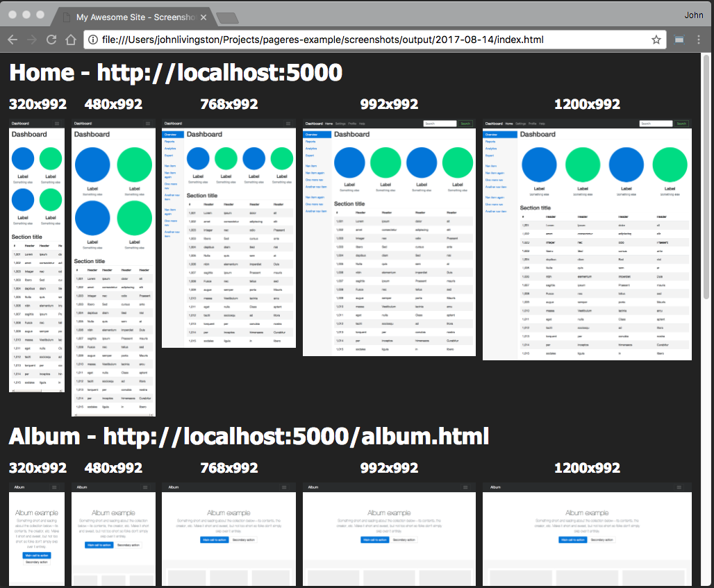

# pageres example

Simple scripts for creating screenshots and checking the mobile friendliness of your site. Just update the **baseUrl**, **siteMap**, **siteTitle**, and **resolutions**, then run. This script will create a base directory based on the date, then subfolders with each individual site. Finally an index.html will be created for viewing.

## Screenshot

- Click on URL to navigate to page
- Click on images to see them individually

## References

<a target="_blank" title="pageres" href="//github.com/sindresorhus/pageres">pageres</a>